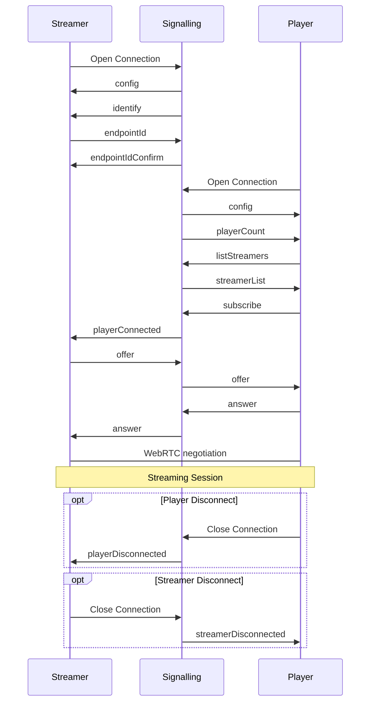

# Pixel Streaming 信令协议

以下内容是当前信令服务器消息协议的完整参考。这些消息是以字符串形式序列化（stringified）的 JSON 数据包进行发送。有些参数本身也是 JSON 字符串，在传递时需要在字符串中进行适当的转义。

---

## 术语 

### 信令服务器 (Signalling Server)
> 负责路由消息并管理新连接的服务器。

### Streamer
> 进行媒体流推送的实体。

### Player
> 媒体流的接收者。可以是被动接收，也可以通过数据流参与互动。

### SFU
> Selective Forwarding Unit（选择性转发单元）。这是一个特殊类型的 Player，它先消费流，然后可将该流转发给新加入的 Player。当需要同时向大量用户分发流，而 Streamer 的编码资源不足以满足需求时，这种方式尤其有用。
> 此外，它还支持 simulcast（多码率同时广播），使得 Streamer 可以同时推送多种不同质量的流，并由 SFU 根据各个 Player 的网络质量选择性地转发合适的流给他们。

### SDP
> Session Description Protocol（会话描述协议）。这是一种用于在两个端点之间协商媒体连接的消息格式。详情可参考[此处](https://www.tutorialspoint.com/webrtc/webrtc_session_description_protocol.htm)或[此处](https://webrtchacks.com/sdp-anatomy/)。

### ICE Candidate
> Interactive Connectivity Establishment。描述了 WebRTC 与远程设备进行通信时所需的协议和路由。更多信息请查阅[此处](https://developer.mozilla.org/en-US/docs/Web/API/RTCIceCandidate)。

---

## 流媒体消息序列示例 

